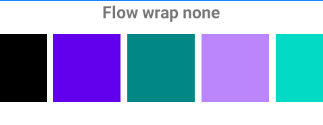
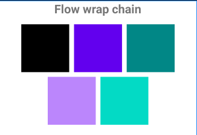
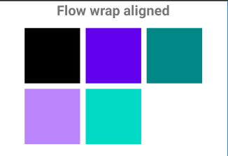

# constraint-layout-flow-example
A small example of Android's [Flow](https://developer.android.com/reference/androidx/constraintlayout/helper/widget/Flow) implementation. 

### Wrap **none**



```
<androidx.constraintlayout.helper.widget.Flow
        android:layout_width="wrap_content"
        android:layout_height="wrap_content"
        app:constraint_referenced_ids="view1,view2,view3,view4,view5"
        app:flow_horizontalGap="10dp"
        app:flow_verticalGap="10dp"
        app:flow_wrapMode="aligned" />

    <View
        android:id="@+id/view1"
        android:layout_width="100dp"
        android:layout_height="100dp"
        android:background="@color/black" />

...

```

### Wrap **chain**



```
<androidx.constraintlayout.helper.widget.Flow
        android:layout_width="wrap_content"
        android:layout_height="wrap_content"
        app:constraint_referenced_ids="view1,view2,view3,view4,view5"
        app:flow_horizontalGap="10dp"
        app:flow_horizontalStyle="packed"
        app:flow_verticalGap="10dp"
        app:flow_wrapMode="chain" />

    <View
        android:id="@+id/view1"
        android:layout_width="100dp"
        android:layout_height="100dp"
        android:background="@color/black" />

...

```

### Wrap **aligned**



```
<androidx.constraintlayout.helper.widget.Flow
        android:layout_width="wrap_content"
        android:layout_height="wrap_content"
        app:constraint_referenced_ids="view1,view2,view3,view4,view5"
        app:flow_horizontalGap="10dp"
        app:flow_verticalGap="10dp"
        app:flow_wrapMode="aligned" />

    <View
        android:id="@+id/view1"
        android:layout_width="100dp"
        android:layout_height="100dp"
        android:background="@color/black" />

...

```